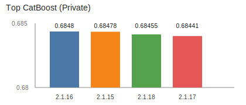

# CIBMTR - Equity in post-HCT Survival Predictions

[](https://www.python.org/)
[](https://catboost.ai/)
[](https://jupyter.org/)
[](LICENSE)

Code and notebooks from my solution for the Kaggle/CIBMTR research competition on equitable post‑HCT survival prediction.

- Competition: [Overview](https://www.kaggle.com/competitions/equity-post-HCT-survival-predictions/overview) · [Data](https://www.kaggle.com/competitions/equity-post-HCT-survival-predictions/data)
- My profile: [`@nickalymov`](https://github.com/nickalymov)

## Highlights

- Strong CatBoost pipeline; top private score ~0.6848.
- Competition placement: 2127/3325.
- Clear, reproducible steps with local data download via Kaggle API.
- Notebooks preserved for transparency; heavy data/artifacts are git‑ignored.

## Pipeline


## Results



| Experiment | Public | Private |
|---|---:|---:|
| CatBoost 2.1.16 | 0.68352 | 0.68480 |
| CatBoost 2.1.15 | 0.68351 | 0.68478 |
| CatBoost 2.1.18 | 0.68328 | 0.68455 |
| CatBoost 2.1.17 | 0.68369 | 0.68441 |
| Best NN (1.1.x) | 0.67076 | 0.67481 |

## Repository structure

This repo preserves experiment history (many notebooks), while excluding private/heavy data and binary artifacts via `.gitignore`.

- `B.Process/` — experiment notebooks (NN and trees). Multiple versions kept.
- `Data/` — EDA and feature engineering notebooks; dataset split logic (no raw competition files tracked).
- `D.Data/` — local data directory (ignored). Put downloaded competition files here.
- `transform_target/` — target transformation utilities.
- `scripts/` — helper scripts like `scripts/kaggle_download.py`.
- `metric.py` — competition metric helpers.

## Quickstart

1) Create environment and install deps

```bash
python -m venv .venv
. .venv/Scripts/activate  # PowerShell: .venv\\Scripts\\Activate.ps1
pip install -U pip
pip install -r requirements.txt
```

2) Configure Kaggle API

- Have a Kaggle account and accept the competition rules.
- Create API token (Account → Create New API Token). Place `kaggle.json` at `%USERPROFILE%/.kaggle/kaggle.json` or project root.

3) Download data

```bash
python scripts/kaggle_download.py --dest D.Data/main
```

4) Run notebooks

- Open notebooks under `Data/` and `B.Process/`.
- For inference‑only, use `B.Process/2.Trees/2.1_CAT/2.1.16/*_test.ipynb` (or `2.1.18`) to produce `submission.csv`.

## Governance

- This is a public repository. Only collaborators can push to `main`.
- External contributions are welcome via pull requests. Changes require review/approval before merge.
- Issues/bug reports are appreciated.

## Author

- **Nick Alimov** — `@nickalymov` — UTC+03:00  
  GitHub: [`https://github.com/nickalymov`](https://github.com/nickalymov)  
  Kaggle: [`https://www.kaggle.com/qurusx`](https://www.kaggle.com/qurusx)  
  Telegram: [`https://t.me/nickalymov`](https://t.me/nickalymov)

## License

MIT — see `LICENSE`.
